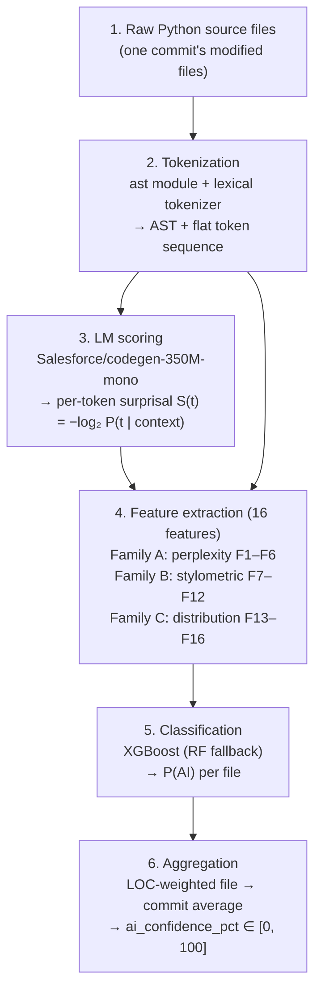

# Deltx AI Authorship Detection Module

## Overview

The detection module (Stage 2 of the Deltx pipeline) addresses the
*Invisibility Gap*: modern repositories contain a growing share of LLM-generated
code, and that share is invisible to conventional quality metrics. For every
commit in a repository's history, this module assigns a probabilistic
AI-authorship score — `ai_confidence_pct ∈ [0, 100]`, where 0 means high
confidence the code is human-written and 100 means high confidence it is
LLM-generated. That scalar occupies index `[4]` of the 15-dimensional commit
vector consumed by the PatchTST forecasting stage, acting as an *Evolutionary
Driver* in the quality-decay prediction.

Internally, each Python file touched by a commit is tokenized, scored against a
pre-trained autoregressive code language model
(`Salesforce/codegen-350M-mono`), reduced to a 16-dimensional feature vector
spanning three feature families (perplexity/surprisal, stylometric,
distribution), and classified with an XGBoost model trained on labelled
human-vs-AI corpora. File-level probabilities are aggregated to the commit
level via a LOC-weighted average. Processing is offline batch, targeting
50–100 commits/minute including overhead; SHAP (TreeExplainer) attribution
explains which features drove each classification.

## Architecture



Module layout:

```
src/deltx/detection/
├── models.py       # Pydantic data models (FeatureVector, results, traces)
├── parser.py       # Python AST parsing + lexical tokenization
├── features/
│   ├── perplexity.py    # F1–F6 (language-model surprisal)
│   ├── stylometric.py   # F7–F12 (code style)
│   └── distribution.py  # F13–F16 (statistical distribution)
├── pipeline.py     # FeatureExtractionPipeline (orchestrator)
├── classifier.py   # DetectionClassifier (XGBoost + SHAP)
├── inference.py    # AIDetectionInference (file → commit scoring)
├── dataset.py      # DatasetManager (download, unify, split)
└── cli.py          # Command-line interface (deltx-detect)
```

## Feature Taxonomy

Surprisal definition: `S(tᵢ) = −log₂ P(tᵢ | t₁, t₂, …, tᵢ₋₁)` (bits).

| ID  | Family        | Name                    | Description                                                    |
|-----|---------------|-------------------------|----------------------------------------------------------------|
| F1  | Perplexity    | Mean Token Surprisal    | Arithmetic mean of S(tᵢ) across all tokens                     |
| F2  | Perplexity    | Surprisal Variance      | Variance of per-token surprisal values                         |
| F3  | Perplexity    | Sequence Perplexity     | `2 ** mean(S)`; model uncertainty measure (base-2)             |
| F4  | Perplexity    | Max Surprisal           | `max(S)`; peak anomaly token                                   |
| F5  | Perplexity    | Low-Surprisal Ratio     | Fraction of tokens with S below `low_surprisal_threshold`      |
| F6  | Perplexity    | Surprisal Slope         | Linear-regression slope of S over token position               |
| F7  | Stylometric   | Avg Identifier Length   | Mean character length of variable/function/class names         |
| F8  | Stylometric   | Identifier Diversity    | Unique identifiers / total identifier count                    |
| F9  | Stylometric   | Whitespace Consistency  | Std deviation of indentation levels across lines               |
| F10 | Stylometric   | Comment-to-Code Ratio   | Comment lines / lines of code; **unbounded** (LOC excludes comment-only lines) |
| F11 | Stylometric   | AST Depth (Mean)        | Average nesting depth of AST nodes                             |
| F12 | Stylometric   | AST Node-Type Diversity | Shannon entropy of AST node-type frequency distribution        |
| F13 | Distribution  | Shannon Entropy         | `H = −∑ p(t) log₂ p(t)` over the token distribution            |
| F14 | Distribution  | Zipf Coefficient Dev.   | Deviation from the expected Zipf exponent (frequency vs. rank) |
| F15 | Distribution  | Bigram Repetition Rate  | Fraction of token bigrams appearing more than once             |
| F16 | Distribution  | Hapax Legomena Ratio    | Fraction of tokens appearing exactly once                      |

Field names on `FeatureVector` follow the pattern `f1_mean_surprisal` …
`f16_hapax_legomena_ratio`; `FeatureVector.feature_names()` returns them in
F1–F16 order and is the single source of truth for column ordering.

> **F10 is a ratio to *code*, not to total lines, and is therefore unbounded.**
> `lines_of_code` counts non-empty, non-comment-only lines (`parser.py`), so a
> heavily-commented file can exceed 1.0 — on the 94k-row droid-only feature
> matrix, 0.45% of rows do, with a maximum of 108. This is the intended
> definition (it is comment *density* over code, which is what the feature name
> says), not a defect. It is safe for the tree ensemble, which splits on
> thresholds and is scale-invariant, but any future model that assumes bounded
> or normally-distributed inputs must scale this feature. Files with zero lines
> of code short-circuit to an all-zero stylometric vector, so the division is
> guarded.

## Usage Examples

### a. Analyzing a single file

```python
from pathlib import Path

from deltx.common.config import DeltxConfig
from deltx.detection.inference import AIDetectionInference

config = DeltxConfig()  # requires a trained model at config.classifier_path
detector = AIDetectionInference.from_config(config)

source = Path("my_module.py").read_text(encoding="utf-8")
result = detector.analyze_file(source, Path("my_module.py"))

print(result.ai_confidence)        # P(AI) in [0, 1]
print(result.is_parseable)         # False → unclassifiable, assumed human
print(result.feature_vector)       # the 16-D FeatureVector
```

Or from the command line:

```bash
poetry run deltx-detect analyze --file my_module.py
poetry run deltx-detect analyze-dir --dir src/my_package
```

### b. Analyzing a commit

```python
from datetime import UTC, datetime
from pathlib import Path

files = {
    Path("src/app.py"): app_source,
    Path("src/utils.py"): utils_source,
    Path("README.md"): readme,       # skipped automatically (not .py)
}
result = detector.analyze_commit(
    files=files,
    commit_hash="a1b2c3d4",
    timestamp=datetime.now(UTC),
    author="alice",
)

print(result.ai_confidence_pct)      # LOC-weighted average, [0, 100]
print(result.total_files_analyzed)   # Python files scored
print(result.total_files_skipped)    # non-Python / boilerplate files

# Batch mode (with a rich progress bar):
results = detector.analyze_commit_batch(
    [{"files": files, "commit_hash": "a1b2c3d4", "timestamp": datetime.now(UTC)}]
)
```

Skipped automatically: non-`.py` files, `setup.py`, `conftest.py`, and anything
under `__pycache__`. Unparseable files are excluded from the commit average
("assume human when in doubt"); a commit with nothing classifiable scores 0.0.

### c. Training the classifier on custom data

> For the full production workflow — assembling a balanced multi-source corpus,
> GPU feature extraction, and leave-one-model-out evaluation — see
> **[training.md](training.md)**. The snippet below is the minimal programmatic path.

```python
import numpy as np

from deltx.common.config import DeltxConfig
from deltx.detection.classifier import DetectionClassifier
from deltx.detection.dataset import DatasetManager
from deltx.detection.pipeline import FeatureExtractionPipeline

config = DeltxConfig()
manager = DatasetManager(config)

# 1. Download and unify the corpora (Python-only, deduplicated, 0=human 1=AI).
manager.download_aigcodeset()
df = manager.load_and_unify(sources=["aigcodeset"], max_per_source=5000)

# 2. Extract the 16 features per sample (checkpointed; resumable).
pipeline = FeatureExtractionPipeline(config)
features = manager.extract_features_dataset(
    df, pipeline, output_path=Path("data/processed/features.parquet")
)

# 3. Split and train. holdout_model performs leave-one-model-out evaluation.
train_df, test_df = manager.prepare_train_test_split(features, test_size=0.2)
classifier, results = DetectionClassifier.train_and_evaluate(
    config, train_df, test_df
)  # tunes hyperparameters, evaluates, computes SHAP, saves the model

# Or drive it manually with raw arrays:
classifier = DetectionClassifier(config)
classifier.train(X_train, y_train, tune_hyperparameters=False)
metrics = classifier.evaluate(X_test, y_test)
classifier.save()  # → config.classifier_path
```

### d. Running SHAP analysis

```python
importance = classifier.compute_shap_importance(X_test, max_samples=1000)

importance["feature_ranking"]   # feature names, most → least important
importance["mean_abs_shap"]     # {feature name: mean |SHAP| value}
importance["shap_values"]       # raw (n_samples, 16) array for plotting

for name in importance["feature_ranking"][:3]:
    print(f"{name}: {importance['mean_abs_shap'][name]:.4f}")
```

SHAP values are exact TreeExplainer log-odds contributions toward the positive
(AI) class. The full pipeline can be validated end to end with
`poetry run python scripts/validate_pipeline.py`.

## Configuration Reference

`deltx.common.config.DeltxConfig` (Pydantic `BaseSettings`; every field is
overridable via a `DELTX_`-prefixed environment variable or a `.env` file,
e.g. `DELTX_DEVICE=cuda`):

| Field                     | Type    | Default                          | Purpose                                                      |
|---------------------------|---------|----------------------------------|--------------------------------------------------------------|
| `model_name`              | `str`   | `Salesforce/codegen-350M-mono`   | HuggingFace ID of the surprisal-scoring code language model  |
| `model_cache_dir`         | `Path`  | `data/models/codegen`            | Local cache directory for the language model                 |
| `device`                  | `str`   | `auto`                           | Torch device; `auto` picks CUDA when available, else CPU     |
| `low_surprisal_threshold` | `float` | `2.0`                            | Bits threshold for the F5 low-surprisal ratio                |
| `classifier_path`         | `Path`  | `data/models/detector.joblib`    | Where the trained XGBoost classifier is saved/loaded         |
| `batch_size`              | `int`   | `32`                             | Batch size for model inference                               |
| `max_sequence_length`     | `int`   | `1024`                           | Token truncation length for language-model scoring           |
| `confidence_threshold`    | `float` | `0.5`                            | Decision boundary for `DetectionClassifier.predict`          |
| `random_seed`             | `int`   | `42`                             | Seeds sampling, CV folds, model training, SHAP subsampling   |

## API Reference

### `deltx.detection.inference`

**`class AIDetectionInference(pipeline, classifier)`** — production entry point.

| Method | Signature | Description |
|--------|-----------|-------------|
| `from_config` | `(cls, config: DeltxConfig) -> AIDetectionInference` | Build the pipeline and load the trained classifier; raises `ModelNotLoadedError` if absent |
| `analyze_file` | `(source_code: str, file_path: Path) -> FileAnalysisResult` | Extract features and classify one file; never raises |
| `analyze_commit` | `(files: dict[Path, str], commit_hash: str, timestamp: datetime, author: str \| None = None) -> CommitAnalysisResult` | Score every Python file in a commit and aggregate |
| `analyze_commit_batch` | `(commits: list[CommitRecord], progress: bool = True) -> list[CommitAnalysisResult]` | Batch analysis with optional progress bar |

**`CommitRecord`** — `TypedDict` with `files`, `commit_hash`, `timestamp`, optional `author`.

### `deltx.detection.pipeline`

**`class FeatureExtractionPipeline(config)`** — raw source → 16-D vector. The
language model loads lazily on first use.

| Method | Signature | Description |
|--------|-----------|-------------|
| `extract_file_features` | `(source_code: str, file_path: Path) -> FileAnalysisResult` | All 16 features; a failed family contributes zeros, others proceed |
| `extract_batch` | `(files: list[tuple[str, Path]]) -> list[FileAnalysisResult]` | Sequential batch, one result per input |
| `extract_features_only` | `(source_code: str, file_path: Path) -> FeatureVector \| None` | Training-set mode: `None` unless the parse and all families are clean |
| `__call__` | `(source_code: str, file_path: Path) -> FileAnalysisResult` | Alias for `extract_file_features` |

### `deltx.detection.classifier`

**`class DetectionClassifier(config)`** — XGBoost lifecycle.

| Method | Signature | Description |
|--------|-----------|-------------|
| `train` | `(X_train, y_train, X_val=None, y_val=None, tune_hyperparameters=True) -> dict` | Optional `RandomizedSearchCV` tuning; early stopping when a validation set is given |
| `predict_proba` | `(X) -> ndarray` | P(AI) per sample in `[0, 1]` |
| `predict` | `(X) -> ndarray` | Binary labels thresholded at `config.confidence_threshold` |
| `evaluate` | `(X_test, y_test) -> dict` | accuracy, precision, recall, f1, AUROC, AUPRC, confusion matrix, report |
| `compute_shap_importance` | `(X, max_samples=1000) -> dict` | `mean_abs_shap`, `shap_values`, `feature_ranking` |
| `save` / `load` | `(path: Path \| None = None)` | joblib persistence; defaults to `config.classifier_path` |
| `train_and_evaluate` | `(cls, config, train_df, test_df, feature_columns=None, label_column="label")` | Full train → evaluate → SHAP → save workflow over DataFrames |

### `deltx.detection.dataset`

**`class DatasetManager(config, data_dir=Path("data"))`** — corpora lifecycle.

| Method | Signature | Description |
|--------|-----------|-------------|
| `download_aigcodeset` | `() -> Path` | AIGCodeSet CSVs from HuggingFace (4,755 human + 2,828 AI) |
| `download_droidcollection` | `() -> Path` | DroidCollection parquet shards (~262k Python rows kept) |
| `download_codenet_python` | `() -> Path` | CodeNet `Python800` subset (240k human files) |
| `download_gptsniffer` | `() -> Path` | Writes manual-placement instructions (no Python samples upstream) |
| `load_from_directory` | `(source: str, path: Path \| None = None) -> DataFrame` | One dataset → unified schema |
| `load_and_unify` | `(sources=None, *, max_per_source=None) -> DataFrame` | Load, filter Python, drop short/conflicting/duplicate samples |
| `extract_features_dataset` | `(df, pipeline, output_path=None, *, checkpoint_every=...) -> DataFrame` | 16 features per row, checkpointed and resumable |
| `prepare_train_test_split` | `(df, test_size=0.2, holdout_model=None, ...) -> tuple` | Stratified split or leave-one-model-out holdout |

Unified schema: `source_code`, `label` (0=human, 1=AI), `source_dataset`,
`ai_model`, `language`.

### `deltx.detection.parser` and `deltx.detection.features`

| Class | Key method | Description |
|-------|------------|-------------|
| `PythonSourceParser` | `parse(source_code: str, file_path: Path) -> ParsedSource` | AST + tokens + line/indent statistics; degrades gracefully on syntax errors |
| `PerplexityExtractor(config)` | `compute_surprisal_trace(source_code) -> SurprisalTrace`; `extract_features(trace) -> dict[str, float]` | F1–F6; the LM loads lazily on first trace |
| `StylometricExtractor()` | `extract_features(parsed: ParsedSource) -> dict[str, float]` | F7–F12 |
| `DistributionExtractor()` | `extract_features(parsed: ParsedSource) -> dict[str, float]` | F13–F16 |

### `deltx.detection.models` (Pydantic)

| Model | Purpose |
|-------|---------|
| `ParsedSource` | Parsed representation: tokens, AST, identifiers, line/indent stats |
| `TokenSequence` | Tokens + token IDs for one file |
| `SurprisalTrace` | Per-token surprisal values from the language model |
| `FeatureVector` | The 16 features; `to_array()`, `feature_names()` |
| `FileAnalysisResult` | Per-file: `feature_vector`, `ai_confidence`, `lines_of_code`, `is_parseable`, `error_message` |
| `CommitAnalysisResult` | Per-commit: `ai_confidence_pct`, `file_results`, counts; `aggregate()` implements the LOC-weighted average |

### Exceptions (`deltx.common.exceptions`)

`DeltxError` (base) → `ParsingError`, `FeatureExtractionError`,
`ModelNotLoadedError`, `DatasetError`, `ClassifierError`.
